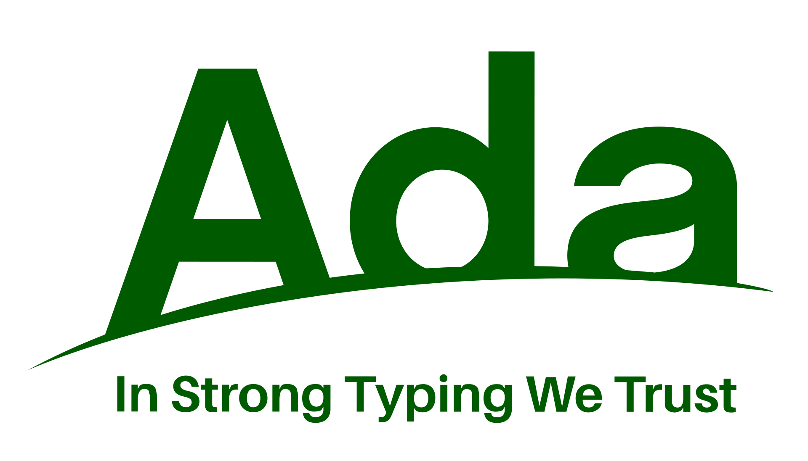

# Ada Language Notes

My simple understanding of Ada Language. Following Ada lovelace tutorial, [here](https://dwheeler.com/lovelace/lovelace.htm)




#### 1. Simple Hello World Program

```
with Ada.Text_IO;
procedure Hello is
begin
	Ada.Text_IO.Put_Line("Hello, world!");
end Hello;
```

- *with Ada.Text_IO*: gives us access to standard libraries or packages by Ada.
- *procedure Hello*: It is a procedure which does the work of printing, and serves as entry point to the program. (like C/C++ it does not have to be "main").
- begin and end is used to the body of the procedure.
- Put_Line prints the string given, using Text_IO package.

We can avoid writing Ada.Text_IO every time to access procedures in the package, like `using namespace`, we have an alternative, we can add `use` clause.

```
with Ada.Text_IO;
use Ada.Text_IO;
...
Put_Line("Hello_World");
...
```

#### 2. Infinite Power of 2s

```
with Ada.Text_IO, Ada.Integer_Text_IO;
use Ada.Text_IO, Ada.Integer_Text_IO;
 
procedure Compute is

procedure Double(Item : in out Integer) is
begin
	Item := Item * 2;
end Double;

X : Integer := 1;

begin
	loop
		Put(X);
		New_Line;
		Double(X);
	end loop;
end Compute;
```

- `Ada.Integer.Text_IO` : Allows use to do text input and output on Integer datatype.
- `procedure Double` : it is a nested procedure which is defined inside the scope of Compute, with a parameter Item : in out Integer, saying value is both received and modified. It multiplies the number by 2.
- `loop` : It starts and infinite loop, as there is no exit condition. Below is the loop syntax.
	```
	loop  
	   Get(Current_Character);  
	   exit when Current_Character = '*';  
	end loop;
	```

##### Notes:
Programming Units:
	1. *subprogram*: which define executable programs, example: procedure and functions.
	2. *package*: defines collection of entities. They are grouping mechanisms. An entity is any singular, identifiable and separate object.
	3. *task unit*: defines computation that can occur in parallel.
	4. *protected unit*: which can coordinate data sharing between parallel computations.
	5. *generic unit*: which helps to make reusable components. (like templates in C++).

Parts of Programming units:
	1. *declaration*: which contains information visible to other programming units. It serves as interface (like contents of .h files in C).
	2. *body*: which contains the implementation, and this need not be made visible to others. (like .c files in C).

Compilation units:
A compilation unit contains either the declaration or the body of a program unit, preceded by the necessary context clause (`with' or `use' clauses). Thus a compilation unit can be a package declaration, a package body, a subprogram declaration, or a subprogram body along with its context clause.

##### Ada Lexical Elements:
lowest level and forms compilations units, these include identifiers, reserve words and punctuation marks.
- Ada is  **case insensitive**.
- Identifiers must begin with a letter, though after that initial letter they may also contain digits and underscores
- Numerical literals: There are two type:
	1. real literals: includes `.`, which denotes decimals and fractions. 
	2. integer literals: represents integer.
	Traditional exponent operators (such as 1.0E9) are permitted in numeric literals. Exponents are even allowed for integer literals, though for integer literals the exponent must not be negative.
	To make long numbers easier to read, underscores are permitted inside a numeric literal. For example, `1_000_000` is legal.
- Character & String Literals: a single character is enclosed with `'c'`, and strings are enclosed inside `"string"`
- `/=` represents not equal to operation.

##### Subprogram Declaration and Parameters:
- The main difference between a procedure and function is that a function returns a value, while a procedure does not (though a procedure can change the values of parameters sent to it).

Example of procedure declaration which computes average of two numbers.
`procedure Average(A, B : in Integer; Result : out Integer);`

Example of function declaration of the same.
`function Average_Two(A, B : in Integer) return Integer;`

- Note the keywords `in' and `out'; this indicates the _mode_ of the parameter. There are three possible modes:
	1. `in' - the parameter's value may be used but not changed.
	2. `out' - the parameter's value may be changed but not used.
	3. `in out' - the parameter's value may be used and/or changed.
- Subprogram Bodies: A subprogram body starts out with a subprogram specification (which is the subprogram declaration without the final semicolon) followed by the keyword "is". This is followed by a declaration of local variables, the keyword "begin", the statements to be executed, and then the keyword "end". 
- Local variables and local subprograms can be declared between the "is" and the "begin". Local variables and local subprograms exist as long as their enclosing subprogram exists.

##### If Statements:
syntax of if statement:
```
 if A = B then
    A := B + 1;
 else
    A := B - 1;
 end if;
```

you can also use `elsif`.

##### Case Statements:
syntax of case statements:
```
case A is                      
    when 1          => Fly;
    when 3 .. 10    => Put(A);
    when 11 | 14    => null;
    when 2 | 20..30 => Swim;
    when others     => Complain;
  end case;
```

##### Simple Loops:
```
with Text_IO, Ada.Integer_Text_IO;
use  Text_IO, Ada.Integer_Text_IO;
procedure Print_Squares is
 X : Integer;
begin
 loop
  Get(X);
 exit when X = 0;
  Put(X * X);
  New_Line;
 end loop;
end Print_Squares;
```

There are two styles of loop: 1. for loop and 2. while loop.

for loop syntax:
```
 for Count in 1 .. 20
 loop
   Put_Line("Hello");
 end loop;
```
Note: 
`for J in 10 .. 1 loop` - repeats zero times (i.e. it never executes the loop contents) because 10 is always greater than 1.
actual way to do it is:
`for J in reverse 1 .. 10`.

while loop syntax:
```
 while N < 20
 loop
  Put(N);
  N := N + 1;
 end loop;
```

##### Custom Types:
To create a new type, use a _type declaration_.

A type declaration begins with the keyword _type_, followed by the name of the new type, the keyword _is_, and then a definition of the new type. Here's an example of a new type named _Column_ which can only have integer values in the range 1 through 72, and another type called _Row_ that has values 1 through 24:

 `type Column is range 1 .. 72;`
 `type Row    is range 1 .. 24;`

A _subtype_ is simply another name for an existing type that may have some additional constraints on it.
```
 type Count is range 0 .. 99_999;
 subtype Widget_Count is Count range 0 .. 99;
 subtype Egg_Count is Count;
```

##### Enumeration:
Often a variable can have only one of a small set of values. An _enumeration_ type can be created for such variables, making it easier to understand and permitting error detection.

```
type Day is (Monday, Tuesday, Wednesday, Thursday, Friday, Saturday, Sunday);
subtype Weekday is Day range Monday .. Friday;
subtype Weekend is Day range Saturday .. Sunday;
``` 

##### Arrays:
An array type in Ada can contain many components with the same subtype.
	1. Ada array indices are not required to start at zero or one.
	2. Like many other things in Ada, array accesses (both read and write) are normally checked at run-time. Thus, if the array index is out-of-bounds, instead of quietly doing the wrong thing, an _exception_ will be raised. This catches a surprisingly large number of errors.
	3. Multi-dimensional arrays are handled in an intuitive way.
	4. A directive can be used to _pack_ arrays, which requests the compiler to store the array in a memory-efficient way. This is particularly handy for arrays of Boolean and Character values.
	5. Using a value from an array intentionally looks like a function call. That way, if you change an array into a function, code that uses the values often needs relatively few changes.
	6. You can define array types without completely fixing their minimum and maximum size. These are called `unconstrained' arrays.
Examples:
```
type Table is array(1 .. 100) of Integer;
type Schedule is array(Day) of Boolean;
type Grid is array(-100 .. 100, -100 .. 100) of Float;
```

- Sample variable declarations:
```
Products_On_Hand : Table;
Work_Schedule : Schedule;
Temperature : Grid;
```

- uses-cases:
```
Products_On_Hand(1) := 20;
Work_Schedule(Sunday) := False;
Temperature(0,0) := 100.0;
Put(Products_On_Hand(1));
```

##### Record (a.k.a struct in C/C++)
Types can be a complex collection of other types; the primary method for collecting these is through the record.

```
 type Date is
  record
   Day   : Integer range 1 .. 31;
   Month : Integer range 1 .. 12;
   Year  : Integer range 1 .. 4000 := 1995;
  end record;

 procedure Demo_Date is
   Ada_Birthday : Date;
 begin
   Ada_Birthday.Month := 12;
   Ada_Birthday.Day   := 10;
   Ada_Birthday.Year  := 1815;
 end Demo_Date;
```

##### Types of Strings:
1. Fixed length string - "hello"
2. Bounded string - can vary in length, up to some max length.
3. Unbounded string - can vary up to largest length possible.
4. Other Language string - you can use string representation of other languages like C, Cobol etc.

Some examples of string usage:
```
with Text_IO; use Text_IO;
  procedure String1 is
    A : String := "Hello";
    B : String(1..5);
  begin
    B := A;                      -- B becomes "Hello"
    A(1) := 'h';                 -- A becomes "hello"
    A(2..3) := A(4..5);          -- A becomes "hlolo"
    A := B(1) & A(2..3) & "ol";  -- A becomes "Hlool"
    Put_Line(A);
    A(2..3) := B(2..3);
    Put_Line(A);
  end String1;
```

- you can use `&` to concatenate strings.

The smallest index value of a String named A is written as `A'First`. Similarly, the largest index value is `A'Last`, and the string's length is `A'Length`.

#### 3. Reverse String
```
with Ada.Text_IO;
use Ada.Text_IO;  
procedure StringOperation is
    procedure reverse_string(S: in String) is
    begin
        for I in reverse S'First .. S'Last loop
            Put(S(I));
        end loop;
    end reverse_string;
    Str: String := "A hello";
begin
    reverse_string(Str(3..Str'Last));
end StringOperation;
```

API's used for Unbounded_String.
1. `Element(source, index);`
2. `Slice(source, low, high);`
3. `Insert(source, Before: in Positive, new_item: in String);`
4. `Delete(source, From, Through);`

##### Text File Input/Output.
All operations on files operate on objects of type File_Type. 

The default for inputting operations (such as Get) is `Current_Input` (`Current_Input` is of type `File_Type`), while the default for all outputting operations (such as `Put` and `Put_Line`) is `Current_Output` (which also has type `File_Type`).

Before a text file can be read or written it must be either opened or created.

There are two basic procedures in Text_IO, called, naturally enough, Open and Create. Open opens an existing file, while Create creates a new file (eliminating the original file) and then opens it.

Before you stop your program you should close all the files you've opened; the Close procedure is used to do that. Here are their definitions:

```
procedure Create (File : in out File_Type;
				Mode : in File_Mode := Out_File;
				Name : in String    := "";
				Form : in String    := "");

procedure Open   (File : in out File_Type;
				Mode : in File_Mode;
				Name : in String;
				Form : in String := "");

procedure Close  (File : in out File_Type);
```

The `Mode` can be `In_File` (an input file), `Out_File` (an output file), or `Append_File` (an output file appending after existing text).

#### 3. File Writing

Ada program to write files.

```
with Ada.Text_IO;
use Ada.Text_IO;
procedure file_writer is
    New_File: File_Type;
begin
    Create(New_File, Out_File, "hi.txt");
    Put_Line(New_File, "Hi, this is test");
    Close(New_File);
end file_writer;
```

##### Line and File Endings
1. `Procedure New_Line` : `New_Line` ends the current line and starts a new line. It takes an optional parameter indicating how many new lines to create (the default is one). You can also specify the file to output this new line to (the default is `Current_Output`).

2. `Procedure Skip_Line` : `Skip_Line` is the counterpart of `New_Line`; it gets ready to read the line after the current line, discarding any text on the current line that hasn't been read.

3. `Function End_Of_Line`: `End_Of_Line` returns True if the input is at the end of the line (else it returns False).

4. `Function End_Of_File`: `End_Of_file` returns True if the input is at the end of the file (else it returns False).

5. `Function Line` : reports the current line number of the file you're reading or writing (the first line is number 1). This is useful if you're processing some input data and you've suddenly found an input problem. 

##### Package Command Line.
Similar to C's `argc, argv and exit`. Its definition:
```
  package Ada.Command_Line is
    function Argument_Count return Natural;
    function Argument (Number : in Positive) return String;
    function Command_Name return String;

    type Exit_Status is _implementation-defined integer type;_
    Success : constant Exit_Status;
    Failure : constant Exit_Status;
    procedure Set_Exit_Status (Code : in Exit_Status);
    -- ...
  end Ada.Command_Line;
```


Doubts:
Unable to use Ustrings package.
getting this error:
```
x86_64-linux-gnu-gcc-10 -c test.adb
test.adb:1:56: file "ustrings.ads" not found
test.adb:4:11: warning: file name does not match unit name, should be "show.adb"
gnatmake: "test.adb" compilation error
```

#### 3. Tasks

The Ada language includes built-in support for concurrent (parallel) processing with Ada _tasks_. Tasks can be started up (activated) and stopped (terminated). 

There are a variety of ways tasks can communicate with each other once they are activated; the main ways are: 
- Tasks can wait for other tasks to complete.
- Tasks can send messages between each other; this is called a rendezvous.
- Tasks can use `protected objects`, which provide exclusive read-write access to data. Protected objects are new to Ada 95.
- Tasks can set global variables to communicate. This last method is efficient but dangerous, especially if you do not have a thorough understanding of concurrency issues. Ada permits this last approach because some real-time system developers really want this capability, but use this approach with great caution.

Note:
- Ada can't create what doesn't exist. On single-CPU machines, Ada must simulate multiple computers on a single computer, and there is some overhead to doing that. This overhead is called the `scheduling overhead`, and a significant portion of the scheduling overhead is something called the `context switching time`. Most compiler vendors provide information about these values.
- Tasks can be under-used or over-used. Some people create hundreds of unnecessary tasks, producing slow, terrible programs. Like any other tool, use tasks appropriately. As a rule of thumb, check what you're doing if you're using more than ten to twenty tasks on a single CPU, especially if more than a few of them are simultaneously active. Also, while there may be many low-level (hardware-level) tasks that do trivial work, tasks should generally not simply do a trivial operation and then send information on to yet another task. Do not follow these rules slavishly; think of these as naive guidelines until you understand tasking more completely.

Technically speaking, an Ada program always includes at least one task, called the _environment_ task; the main (starting) subprogram runs in this environment task.


Topics not covered:
- Private and Limited Private types.
- Chapter 7: Object Oriented Programing.
- Chapter 10: Exceptions.
- Chapter 11: Generics
- Chapter 12: Access Types
